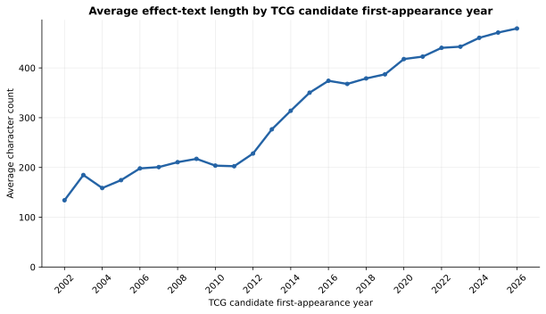
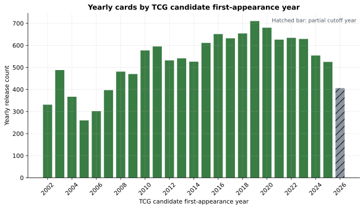
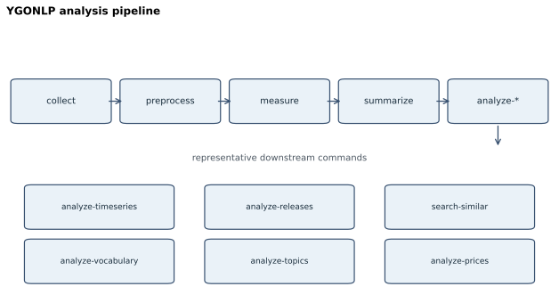

# 遊戯王カード14,000枚を自然言語処理するCLI「YGONLP」を2日で作った

## この記事で分かること

この記事では、約14,000枚の英語版遊戯王カードを対象に、自然言語処理とデータ分析を用いて以下の問いを調べます。

- 遊戯王カードのテキストは本当に長くなっているのか
- 年代によってカード供給量は変化しているのか
- 似た効果テキストを持つカードを検索できるのか
- 遊戯王カードにはどのような語彙パターンが存在するのか
- テキスト長とカード価格には関係があるのか

使用したコードは、再現可能なCLI研究プロジェクト「YGONLP」として構築しています。

## 結論：14,000枚を解析して見えたこと

既存の年別集計では、英語版効果テキストの平均的な長さは近年ほど高い水準にある傾向が見えます。一方、年ごとのカード数も変動しており、2026年は途中年です。したがって、図が示すのは対象datasetにおける文章量とカード数の記述的な変化であり、カードの強さ、ゲーム上の難しさ、変化の原因を示すものではありません。

以下では、まず何を対象にしたかと年別の分析結果を示し、その後に再現方法と実装上の設計を説明します。

## 何を調べたか

### はじめに

遊戯王には、20年以上にわたって追加され続けてきた大量のカードデータがあります。

カード名、効果テキスト、種類、発売時期などの情報は、自然言語処理やデータ分析の対象として見ることができます。

しかし、例えば、

> 最近の遊戯王はテキストが長くなった

という感覚的な話は、実際にどの程度正しいのでしょうか。

そこで、感覚ではなく再現可能な形で検証するために、英語版遊戯王カード約14,000件を対象としたCLI研究プロジェクト「YGONLP」を作成しました。

### なぜ作ったのか

きっかけは、

> 最近の遊戯王カードはテキストが長くなっているのではないか？

という素朴な疑問でした。

しかし、このような話題はコミュニティでは頻繁に語られる一方で、定量的な検証を見る機会は多くありません。

そこで、以下のような目的でプロジェクトを開始しました。

- 「最近の遊戯王はテキストが長い」という感覚を検証する
- 遊戯王カードを自然言語処理の対象として扱えるか試す
- 一度きりの分析ではなく、再実行可能な研究環境を作る
- 欠損値や日付定義を曖昧にせず、分析結果を説明可能にする

目的は「遊戯王の強いカードを予測する」ことではありません。

カードテキストという言語データそのものを対象に、どのような変化や特徴が存在するのかを調べることが目的です。

### 最初の研究課題

YGONLPで最初に設定した問いは、次のものです。

> 英語版遊戯王カードの効果テキストのLength Metricsは、時系列でどのように変化してきたか。

ここで重要なのは、「長いテキスト＝複雑なカード＝強いカード」とは限らないという点です。

本プロジェクトでは、「複雑性」を複数の観点に分けて考えています。

#### Length Metrics

まず、最も基本的な指標として、テキスト量を測定します。

- Character count（文字数）
- Word count（単語数）
- Sentence count（文数）

これは「どれくらい長い文章なのか」を測るための指標です。

#### Surface Complexity Metrics

次に、表面的な文章構造を測定します。

例：

- コロンの数
- セミコロンの数
- 括弧の数
- `once per turn` のような定型表現の出現数

これらは遊戯王特有の効果記述形式を分析するための指標です。

#### Structural Metrics

さらに、文章内部の構造にも注目します。

例：

- 条件（condition）
- コスト（cost）
- 対象（target）
- 処理（resolution）

同じ文字数のカードでも、単純な効果と複数段階の処理を持つ効果では構造が異なります。

ただし、**本記事で数値として報告するテキスト分析はLength Metricsだけ**です。Surface Complexity MetricsとStructural Metricsは概念・今後の拡張候補であり、現行の分析結果や図からそれらの複雑性を測定したとは主張しません。

Surface Complexity MetricsやStructural Metricsについては、今後さらに発展させる余地があります。

また、本記事で扱う分析結果について、以下の点には注意が必要です。

- テキスト長はカードの強さを意味しない
- テキスト長は実際の裁定難易度を直接表さない
- 時系列分析は年別の記述統計であり、因果関係や設計上の理由を証明するものではない

つまり、YGONLPが答えようとしているのは、

「最近のカードは強いのか？」

ではなく、

「遊戯王カードという文章データは、時代とともにどのように変化してきたのか？」

という問いです。

### 使用したデータ

初回取得時のraw datasetは以下の規模でした。

- 総レコード数：14,468件
- `tcg_date` が存在するレコード：13,993件
- `tcg_date` 欠損レコード：475件

### 図の分析母集団

raw datasetの全レコードが、そのまま各図の母集団になるわけではありません。まず前処理のtarget policyにより効果テキスト分析の対象を選び、measurementでは**13,431件**の測定recordを得ました。このうち、年別の2図ではUTC cutoff（2026-07-17）までに有効な`tcg_date`を持つ**13,179件**を集計しています。`tcg_date=null`の234件とcutoff後の日付の18件は、欠損日付を推測せずに年別集計から除外し、metadataに件数を記録しています。

従って、図が示すのは「英語版効果テキストの測定対象のうち、TCG初出候補年を確認できるカード」の年別記述値です。全収集レコード、全印刷、全再録、または公式発売履歴の完全な母集団を表すものではありません。

時系列分析では、カードの初出時期として `tcg_date` を利用しました。

ただし、これは「公式の完全な発売日一覧」ではありません。

本プロジェクトでは、

> 採用したTCG set情報に基づくTCG初出候補日

として扱っています。

そのため、以下のような処理は行っていません。

- 欠損した日付の推測
- 架空の日付による補完
- OCG初出日へのfallback
- reprint日や再収録日の利用

不完全なデータを無理に埋めるよりも、「分からないものは分からないまま保持する」ことを優先しました。

## 分析結果

### 分析1：カードテキストは長くなっているのか

最初に調べたかったのは、多くのプレイヤーが感じている、

> 「最近の遊戯王カードはテキストが長くなったのではないか」

という疑問です。

ただし、人間の記憶や印象だけでは、正確な比較はできません。

そこで、英語版カードテキストをデータとして扱い、TCG初出候補年ごとに文章量を比較しました。

#### 見る指標

今回の分析では、まずLength Metricsを利用しました。

対象とした指標は以下です。

- `character_count`
  - 効果テキストの文字数
- `word_count`
  - 単語数
- `sentence_count`
  - 文数

単純に文字数だけを見るのではなく、複数の指標で同じ傾向が現れるかを確認します。

#### 分析方法

カードごとの測定結果を、`tcg_date`から取得したTCG初出候補年ごとに集計しました。

比較では平均値だけではなく、

- median（中央値）
- minimum / maximum
- quartile（四分位範囲）
- population standard deviation

も確認しています。

これらは各年の分布を要約する**記述統計**です。年ごとのカード構成やサンプル数の差を調整した推定、仮説検定、因果効果ではありません。短い効果のカードから非常に長い効果を持つカードまで幅広く存在するため、平均値だけで分布全体を代表させないようにしています。



*図2：TCG初出候補年ごとの平均`character_count`。対象は有効な`tcg_date`を持つ測定recordであり、2026年はUTC cutoff（2026-07-17）時点の途中年である。*

#### この分析で分かること

この分析によって、以下のような傾向を確認できます。

- 効果テキストの平均的な長さが時代によって変化したか
- 文字数・単語数・文数で同じ傾向が見られるか
- 特定年代で急激な変化が存在するか
- カード種別によって違いがあるか

例えば、

「文字数だけが増えているのか」

それとも、

「文章量以外の構造指標も変化しているのか」

を将来検討するための基礎データになります。現行のLength Metricsだけから、文章構造の複雑化を結論づけることはできません。

#### この分析だけでは分からないこと

一方で、この分析だけから以下を結論づけることはできません。

- テキストが長いカードほど強い
- 最近のカードほど難しい
- 最近のカードほど競技性が高い
- テキスト長増加の原因
- テキスト長と売上・人気の因果関係

文章量の変化と、ゲームデザインや競技環境の変化は別の問題です。

YGONLPが示すのは、

> 遊戯王カードという文章データが、時間とともにどのように変化してきたか

という記述的な分析結果です。

### 分析2：年間に登場するカード数はどう変わったか

テキスト長の変化を見る際、もう一つ考える必要がある要素があります。

それは、

> そもそも1年間に何枚のカードが登場しているのか

という点です。

例えば、ある時代にテキストが長くなっていたとしても、それが

- 1枚あたりの文章量が増えた結果なのか
- 大量のカード追加によって構成が変化した結果なのか

は分けて考える必要があります。

そこで、YGONLPではカードテキストの長さだけではなく、年間のカード供給量についても分析しました。

#### 見る指標

`analyze-releases`では、TCG初出候補年ごとに以下を集計します。

- `release_count`
  - その年に初出候補となるカード数
- `cumulative_release_count`
  - その年までの累積カード数

さらに、

- 年 × `card_type`

による内訳も確認できます。

#### 分析方法

カードごとの`tcg_date`から年を取得し、年単位で集計します。

ただし、ここでも日付情報を無理に補完しません。

以下のカードは別途記録します。

- `tcg_date`が存在しないカード
- 現在日時点で未来の日付を持つカード
- 現在年の途中までのデータ

特に現在年については、1年分のデータが揃っていないため、

> partial year（途中年）

として扱います。



*図3：TCG初出候補年ごとのoverall `release_count`。斜線の2026年はUTC cutoff（2026-07-17）までの途中年であり、他年との年間件数比較には注意が必要である。*

#### この分析で分かること

この分析によって、以下を確認できます。

- dataset上で年間カード追加数がどう変化したか
- テキスト長の年別変化を、同じdataset上の年間カード数と併せて記述できるか
- 特定のカード種別が増加しているか

例えば、

「最近のカードは長文化した」

という結果が得られた場合でも、

- カード1枚あたりの文章量が増えた
- 登場カード数そのものが増えた

という2つの可能性があります。

release count分析は、この2つを混同しないための文脈を与えます。ただし、年別件数だけでテキスト長変化の原因を分離・特定することはできません。

#### この分析だけでは分からないこと

ただし、この分析はあくまでdataset上の初出候補数です。

以下を意味するものではありません。

- 商品の発売回数
- ブースターパック数
- 個別printing数
- reprint数
- 公式release eventの完全な再現
- 将来のカード追加数

また、`tcg_date`は採用したTCG set情報に基づく初出候補日であり、公式データベース全体の完全な発売履歴そのものではありません。

そのため、この分析は、

> 遊戯王カードデータセット上で、カード追加ペースがどのように変化したか

を見るためのものです。

### 分析3：似た効果テキストを探す

遊戯王カードには、似たような効果処理や文章表現を持つカードが数多く存在します。

例えば、

- 同じような条件文を持つカード
- 同じ召喚方法に関係するカード
- 過去カードを参考に作られたようなカード

などです。

しかし、14,000枚以上のカードを人間がすべて比較することは現実的ではありません。

そこで、自然言語処理の手法を利用して、

> 効果テキストの文章として近いカードを検索できるか

を試しました。

#### 手法

類似検索には、TF-IDFとcosine similarityを利用しました。

処理の流れは以下です。

1. queryカードを含む候補カードの正規化済み効果テキストを、lowercaseしたword unigramのTF-IDFベクトルへ変換する
2. queryベクトルと各候補ベクトルのcosine similarityを計算する
3. query自身と空テキストを除き、正のscoreを高い順（同値は`card_id`昇順）に返す

使用した設定は以下です。

- TF-IDF Vectorizer
- word unigram
- Unicode対応token pattern
- lowercase有効
- L2 normalization
- IDF smoothing有効
- sublinear TFは無効

この表現は語の重みづけに基づく語彙的な検索であり、意味ベクトル、ルール処理の同一性、カード間の全組合せを意味的に比較するモデルではありません。

#### 検索条件

CLIでは、カードを指定して検索できます。

例：

```text
ygonlp search-similar \
  --input-metadata <preprocessing-metadata-json> \
  --card-id <card-id> \
  --top-n 10
```

検索対象は前処理済みJSONLのみを利用します。

そのため、

- APIへの再アクセスは行わない
- 同じ入力なら同じ結果になる
- 生成結果を再現できる

という設計になっています。

#### 結果の読み方

この検索で得られるsimilarity scoreは、

> 文章としてどれくらい似ているか

を表します。

つまり、

- 同じ単語を多く共有する
- 似た構文を使う
- 同じ定型表現を含む

カードほど高いscoreになります。

#### この分析で分かること

この分析によって、

- 似た効果文章を持つカード
- 共通するテンプレート表現
- 人間が見落としやすい文章上の類似

を発見できます。

大量のカードテキストから、

「このカードと似た文章のカードは何か」

を探索する用途に利用できます。

#### この分析だけでは分からないこと

一方で、文章の類似度はゲーム上の意味とは一致しません。

この分析結果から、

- 効果が同じ
- コンボできる
- 同じデッキに入る
- 強さが近い
- 競技的価値が同じ

とは判断できません。

例えば、同じ「カードを破壊する」という表現を含んでいても、

- 発動条件
- 対象
- タイミング
- コスト
- 裁定

によってゲーム上の意味は大きく異なります。

TF-IDFによる類似検索は、

> 遊戯王カードテキストという文章データの構造を探索するための手法

として利用しています。

### 分析4：遊戯王で頻出する語彙を調べる

遊戯王カードの効果テキストには、長い歴史の中で繰り返し使われてきた表現があります。

例えば、

- 特定の処理を表す定型句
- 多くのカードで共通する単語
- 特定の時代やテーマで増加した表現

などです。

そこで、カードテキスト全体を対象として、

> 遊戯王の効果テキストでは、どのような単語や表現が頻繁に利用されているのか

を分析しました。

#### 手法

語彙分析には、scikit-learnの`CountVectorizer`を利用しました。

対象とする分析は以下です。

- unigram分析
  - 単語単位の頻度分析
- bigram分析
  - 2単語の組み合わせ分析
- document frequency分析
  - 何枚のカードに出現するかの分析

単純な出現回数だけではなく、

「多くのカードに共通して使われる表現」

を見るために、document frequencyも確認します。

#### stopwordの扱い

遊戯王カードでは、

- the
- you
- this
- card

のような一般的な語も大量に登場します。

これらは分析目的によってはノイズになるため、

- stopwordなし
- stopwordあり

の両方を比較できるようにしています。

stopwordなしでは、実際のカード文章で頻出する表現を見ることができます。

一方、stopwordありでは、より特徴的な語や構文を発見しやすくなります。

#### この分析で分かること

語彙分析によって、以下のような特徴を調べられます。

- 遊戯王カードに特徴的な語彙
- 多くのカードで共有される定型表現
- 単なる頻出単語と、広く使われる表現の違い
- 時代やカード種別による語彙傾向

例えば、

「どのような表現が長年使われ続けているのか」

「新しいカード群ではどのような語彙が増えたのか」

といった問いにつなげられます。

#### この分析だけでは分からないこと

ただし、頻出する語が必ずしも重要なゲームメカニクスを表すわけではありません。

この分析だけでは、

- その語が公式mechanic名であるか
- その表現がゲーム上重要か
- その語を含むカードが強いか
- デッキやテーマとの関係
- 文脈を考慮した意味

までは判断できません。

語彙分析は、

> 遊戯王カードという大規模テキスト集合に存在する言語的特徴を探索する手法

として利用しています。

### 分析5：探索的トピック分析

大量のカードテキストを眺めていると、遊戯王にはさまざまな効果表現のパターンが存在することが分かります。

しかし、14,000枚以上のカード文章を人間がすべて分類することは困難です。

そこで、自然言語処理による探索的手法として、

> カードテキスト中に存在する語彙パターンを自動的にグループ化できるか

を試しました。

#### 手法

トピック分析には、Latent Dirichlet Allocation（LDA）を利用しました。

処理の流れは以下です。

1. 空・tokenなし文書を除いた正規化済みテキストを、lowercaseしたunigramの`CountVectorizer`でdocument-term count matrixへ変換する
2. batch learningのLDAに、指定したtopic数・最大iteration・固定random seedを与える
3. 推定された各topicの上位語と、topic比率が高い代表cardを出力する

使用した手法は以下です。

- `CountVectorizer`
- `LatentDirichletAllocation`
- 固定random seed
- 指定したtopic数
- topic index順による出力

固定seedを利用することで、同じ入力・同じライブラリ実装・同じparameterから同じ分析結果を再生成できるようにしています。topicはmodel index順に出力し、公式名や人手による意味ラベルは付けません。

#### 結果の見方

LDAによって得られるtopicは、

「遊戯王公式が定義したカテゴリ」

ではありません。

あくまで、

> データ中で共起しやすい単語群

です。

そのため、出力された上位語を読んでもtopicに確定的な名前を与えません。

例えば、

- 特定の召喚方法に関連する語
- 特定の処理に関連する語
- 特定のカード群で頻出する表現

のような特徴が見える可能性があります。

#### この分析で分かること

探索的トピック分析によって、以下を調べられます。

- カードテキスト内の語彙パターン
- 共通して現れる文章構造
- 大量データから発見できる仮説
- 人間が事前に分類していない文章グループ

例えば、

「遊戯王カードの文章にはどのようなパターンが存在するのか」

という問いに対して、データから探索的な手がかりを得られます。

#### この分析だけでは分からないこと

一方で、LDAの結果を公式分類として扱うことはできません。

この分析だけでは、

- topicが公式mechanicを表す
- topic数が正解である
- topicが必ず意味的カテゴリになる
- archetypeやデッキタイプと一致する
- ゲーム上の役割を分類できる

とは言えません。

また、LDAは文章中の単語分布を利用する手法であり、カード効果のルール処理やゲーム上の意味を理解しているわけではありません。

そのため、この分析は、

> 遊戯王カードテキストに存在する言語的パターンを発見するための探索的分析

として位置づけています。

### 分析6：価格とテキスト長の関係

最後に、カードデータと外部データを組み合わせた分析として、

> カードのテキスト量と市場価格には関係があるのか

を探索しました。

遊戯王では、

- 強力なカード
- 人気テーマのカード
- 希少なカード

などが高価格になることがあります。

一方で、テキストが長いカードほど高価なのか、という問いは別途検証する必要があります。

そこで、カード価格snapshotとテキスト指標を結合し、記述的な分析を行いました。

#### 価格データ

価格情報は、YGOPRODeck APIから取得可能なvendor別価格情報を利用しています。

対応vendor：

- Cardmarket（EUR）
- TCGplayer（USD）
- eBay（USD）
- Amazon（USD）
- CoolStuffInc（USD）

ただし、以下の点には注意が必要です。

- vendorごとに通貨が異なる
- 通貨換算は行わない
- vendor間の価格統合は行わない
- printing・edition・rarity・condition単位の価格ではない

つまり、この分析で扱う価格は、

> 特定snapshot時点に取得したカード単位のvendor価格情報

です。

#### 分析方法

価格snapshotと、カードテキスト測定結果を`card_id`で結合します。

その上で、以下を確認します。

- vendor別価格分布
- `character_count`とのPearson相関
- `character_count`とのSpearman相関
- 文字数bucket別の価格統計

Pearson相関では線形関係を、

Spearman相関では順位関係を確認します。

#### zero priceの扱い

価格データでは、価格情報が存在しない場合があります。

また、`0.00`は欠損値の代替ではなく、APIが返した**観測されたゼロ価格**として保持します。ただし、無料配布、取引量、在庫、価格の正しさを意味するものではありません。

そのため、

- coverage上では保持する
- 既定では統計・相関計算から除外する
- `--include-zero`指定時のみ分析対象に含める

という方針にしています。

#### この分析で分かること

この分析によって、

- snapshot時点での価格とテキスト長の関係
- 文字数が多いカード群の価格傾向
- 線形・順位相関の有無

を確認できます。

例えば、

「長い効果テキストを持つカードほど高価格なのか」

という問いに対して、データから探索できます。

#### この分析だけでは分からないこと

ただし、この分析から以下を結論づけることはできません。

- テキストが長いから高価格になる
- 高価格カードほど複雑な効果を持つ
- テキスト長が価値を決める
- rarityや環境需要を除いた純粋な効果価値
- 将来価格
- 適正価格

カード価格は、

- 需要
- 供給量
- rarity
- 大会環境
- コレクション需要
- 再録状況

など多くの要因によって決まります。

そのため、この分析は因果関係を求めるものではなく、

> 遊戯王カードの文章的特徴と、市場データ上の価格指標にどのような関係が見られるか

を探索するためのものです。

## 分かったこと・分からないこと

年別のLength Metrics、release count、類似検索、語彙・topic、価格の各分析は、入力データに対する記述・探索のためのものです。ここまでの結果を読む際は、次の限界を保ったまま解釈する必要があります。

### カードの強さ

テキストが長いカードが、必ず強いとは限りません。

カードの強さには、

- 効果そのもの
- 発動条件
- 環境との相性
- デッキ構築との関係
- 採用率
- 大会結果

など、多くの要素が関係します。

YGONLPが測定しているのは文章データの特徴であり、競技性能ではありません。

### ゲーム上の難しさ

長い文章は一見複雑に見えます。

しかし、

- 短いが裁定が難しいカード
- 長いが処理が単純なカード

も存在します。

文章量だけで、実際のプレイ難易度や裁定難易度を判断することはできません。

### テキスト長増加の原因

時系列分析によって、

「ある年代から平均テキスト長が増加した」

という傾向を発見できたとしても、

「なぜ増加したのか」

までは、この分析だけでは分かりません。

原因として考えられるものには、

- カードデザインの変化
- 効果処理の複雑化
- ルール整備
- テーマ設計の変化
- 商品展開の変化

など、複数の可能性があります。

### 遊戯王そのものの評価

また、YGONLPは、

- 面白いカードか
- 良いデザインか
- 昔の方が良かったか
- 最近の方が優れているか

といった評価を行うものではありません。

このプロジェクトの目的は、価値判断ではなく、

> 遊戯王カードという文章データに、どのような変化や特徴が存在するのかを調べること

です。

データ分析は、感覚を否定するためのものではありません。

むしろ、人間が感じている「最近長くなった気がする」という感覚を、別の角度から検証するための道具として利用しています。

## 方法・再現性

### 何ができるのか

YGONLPでは、カードデータを取得・検証・加工し、文字数・単語数・文数の測定、年別・カード種別別の時系列分析、年別release count分析、TF-IDFとcosine similarityによる類似テキスト検索、unigram・bigramによる語彙分析、LDAによる探索的トピック分析、vendor別価格snapshot、価格とテキスト長の相関分析をCLIとして再実行できます。



*図1：YGONLPの処理と分析コマンドの依存関係。矢印はデータの入力関係であり、すべての分析が`summary`の後段にあることを意味しない。*

### データをどう集めたか

データソースには [YGOPRODeck API v7](https://db.ygoprodeck.com/api/v7/cardinfo.php) の英語版遊戯王OCG／TCGカードデータを利用しました。初回取得は原則として単一リクエストで行い、以降の分析では保存済みdataを入力としてAPIへ再アクセスしません。カード単位の逐次・並列・大量リクエストは行わず、取得条件と取得日時をmetadataに保存します。

### データ管理方針

Gitで管理するのはソースコード、テストコード、分析仕様書、実行方法です。raw dataset、前処理済みJSONL、分析結果CSV・Markdown、価格snapshotはローカル生成物として扱います。これによりリポジトリを軽量に保ちながら、同じ処理を再実行できます。

#### データ権利と再配布

カード名、カードテキスト、画像、価格などの元データには、それぞれの権利者・データ提供者の利用条件が適用されます。本リポジトリはコード、仕様、集計図だけを管理し、raw data、カードテキスト、価格snapshot、分析用CSV/JSONLを再配布しません。データを取得・再利用する際は、YGOPRODeck APIおよび各vendorの利用規約、ならびに関連する権利関係を利用者自身で確認してください。

### 再現可能性をどう守ったか

YGONLPで重視しているのは、同じ入力から同じ手順で同じ結果を再生成できることです。各段階はmetadataを入力境界とし、入力ファイル、checksum、record count、実行日時、parameter、使用ライブラリversion、出力ファイル情報を記録します。これにより「このCSVはどの処理から生成されたのか」を追跡できます。

JSONLの固定キー順、`card_id`順、集計結果の順序、丸め規則、random seedを固定します。再現できるのは同じコード、依存ライブラリ、parameter、保存済み入力、UTC cutoffを用いた場合です。外部APIの内容、価格snapshot、ライブラリ実装、または取得時点が変われば、再実行結果も変わり得ます。

### 安全なデータ更新とテスト

出力はatomic保存し、正常なcacheを優先します。失敗した生成物は有効dataとして扱わず、`--force`指定時のみcacheを無視します。`--dry-run`は通信やファイル変更なしで実行予定・入力・出力先・cache状態を確認します。`verify-preprocess`はschema、キー順、`card_id`の一意性・並び順、metadataとの整合性を検証し、`cleanup-preprocess`はデフォルトでは候補表示のみを行います。

外部APIや実dataに依存しない固定入力テストにより、欠損値処理、日付処理、集計、出力形式、異常系を検証します。YGONLPは「一回動いた分析コード」ではなく、データ取得から分析までを再実行できる小規模な研究基盤を目指しています。

## 制作メモ

### 作っていて一番難しかったこと

YGONLPを作る上で、一番難しかったのは、単に分析手法を実装することではありませんでした。

本当に難しかったのは、

> 「何を測定したのか」を明確に定義すること

でした。

例えば、

「カードの発売日」

という言葉だけでも、実際には複数の意味があります。

- OCGで初登場した日
- TCGで初登場した日
- 収録パックの発売日
- 再録された日

どれを採用するかによって、分析結果の意味は変わります。

そのため、YGONLPでは、

- 採用する日付の定義
- 欠損値の扱い
- 推測補完を行うかどうか
- 分析対象外のデータ

を明示するようにしました。

また、自然言語処理では、

「似ている」

「複雑」

「特徴的」

といった言葉を簡単に使えてしまいます。

しかし、これらは人間の感覚に依存します。

そこで、

- 類似度とは文章上の類似度である
- topicとは語彙分布上のgroupである
- 複雑性とは定義した指標上の複雑性である

というように、測定対象を限定しました。

データ分析では、複雑なモデルを作ることよりも、

> 何を意味している数字なのかを説明できること

の方が重要だと感じました。

### 今後やりたいこと

現在のYGONLPは、まず「遊戯王カードを大規模テキストデータとして扱えるか」を確認するための基盤作りを目的としています。

今後は、さらに以下のような分析へ発展させたいと考えています。

#### より詳細な文章構造分析

現在実装しているLength Metricsに加えて、より細かい構造分析を行いたいです。

例えば、

- 条件文の数
- コスト表現の数
- 対象指定の数
- 効果処理段階の数
- 発動タイミング表現
- 例外処理表現

などを抽出することで、

「単純に長いカード」

と

「処理構造が複雑なカード」

を区別できる可能性があります。

#### 日本語版カードとの比較

現在の対象は英語版カードです。

しかし、遊戯王のカードテキストは言語によって表現方法が異なります。

例えば、

- 英語版では文章として表現される情報
- 日本語版では省略される表現
- 公式用語の違い

などがあります。

将来的には、日本語版と英語版を比較することで、

「言語によってカードテキストの構造はどう変化するのか」

という問いにも取り組めるかもしれません。

#### より高度な自然言語処理

現在は、

- TF-IDF
- CountVectorizer
- LDA

といった比較的解釈しやすい手法を中心に利用しています。

今後は、

- word embedding
- sentence embedding
- transformer-based model
- 大規模言語モデル（LLM）

などを利用した分析も検討できます。

ただし、より高度なモデルを使う場合でも、

「何を測定しているのか」

を説明できることは重要です。

#### 他のゲームデータへの応用

今回の対象は遊戯王カードでした。

しかし、同じ考え方は他のデータにも応用できます。

例えば、

- 他のカードゲーム
- ゲーム内説明文
- ソフトウェアドキュメント
- 技術文書

など、

大量の文章データを持つ対象であれば、自然言語処理による探索が可能です。

### 最後に

YGONLPは、遊戯王カードを題材にした小さな自然言語処理プロジェクトです。

しかし、本質的には、

> 身近なデータに対して、感覚ではなく再現可能な方法で問いを立てる

ことを目的にしています。

普段遊んでいるゲームでも、データとして見直すことで新しい発見があります。

「最近の遊戯王はテキストが長い」

という何気ない感想から始まったこのプロジェクトが、

データ分析や自然言語処理を学ぶきっかけになれば幸いです。

## おわりに

「最近の遊戯王カードはテキストが長い」

この感覚は、多くのプレイヤーが一度は感じたことがあると思います。

今回作成したYGONLPでは、その感覚を単なる印象で終わらせず、

- どのようなデータを使ったのか
- どのような定義で測定したのか
- どのような限界があるのか

を明示した上で、自然言語処理とデータ分析によって調べました。

結果として、遊戯王カードは単なるゲームの駒ではなく、

- 長期間蓄積された文章データ
- 独自の表現体系を持つ自然言語データ
- 時代によって変化するデザイン情報

として分析できる対象であることが分かりました。

もちろん、データ分析だけですべての答えが出るわけではありません。

しかし、

「なんとなくそう感じる」

という人間の直感を、

「どのデータを見れば検証できるか」

という問いへ変換することはできます。

YGONLPは、遊戯王という身近な題材から始めた小さな研究プロジェクトです。

もしこの記事を読んで、

「自分の好きなゲームや趣味のデータも分析してみたい」

と思ってもらえたなら、このプロジェクトを作った意味があったと思います。

ソースコードはGitHubで公開しています。

データ分析や自然言語処理に興味がある方は、ぜひ自由に眺めてみてください。
